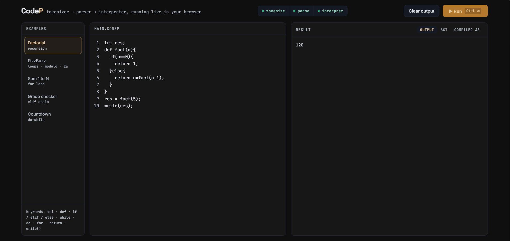
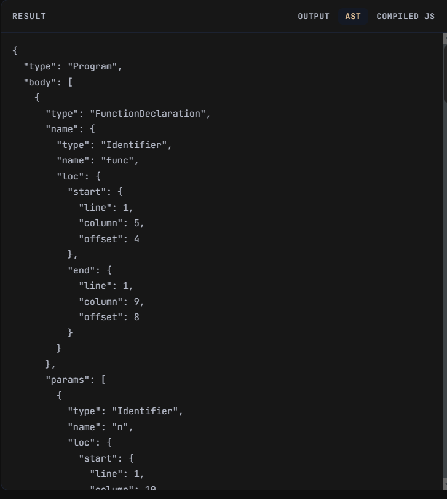
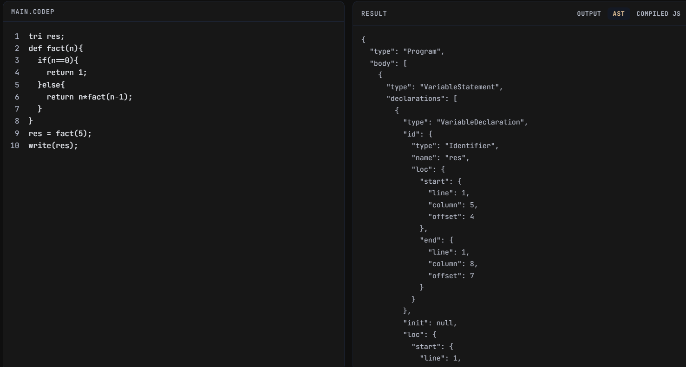
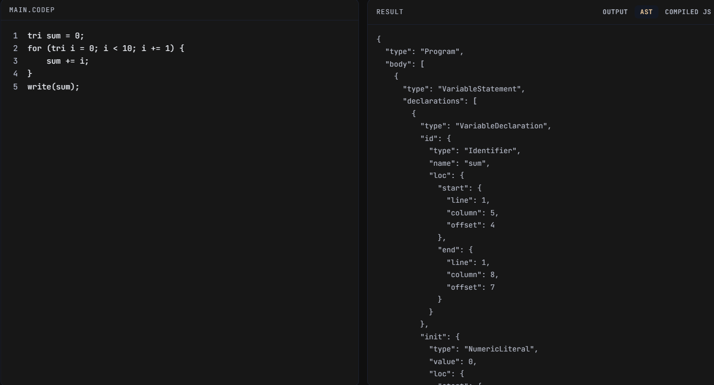
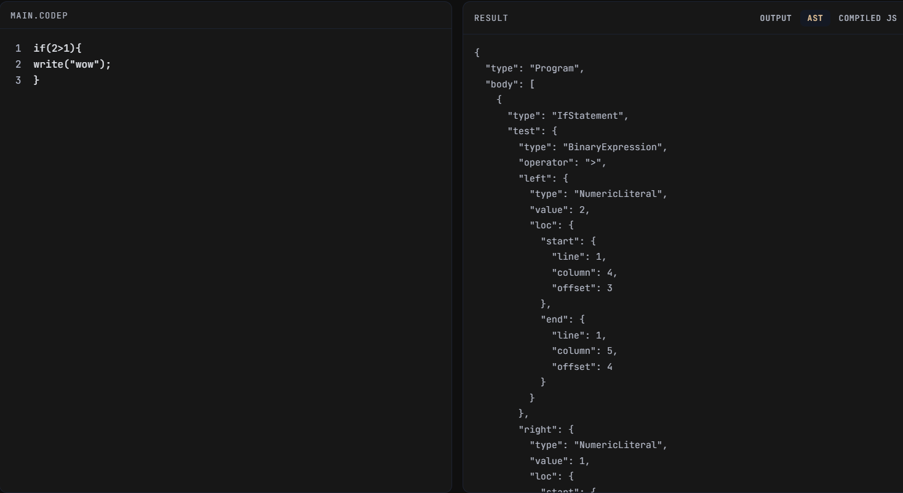

<div align="center">

# ⚡ CodeP

**A tiny JavaScript-flavored scripting language, built from scratch — tokenizer, parser, interpreter and all.**

[](https://nodejs.org)
[](#)
[](#-roadmap)
[](#-license)

</div>

---

## 📖 Table of Contents

- [About](#-about)
- [Getting Started](#-getting-started)
- [Language Guide](#-language-guide)
  - [Variables](#variables)
  - [Data Types](#data-types)
  - [Printing Output](#printing-output)
  - [Operators](#operators)
  - [Conditionals](#conditionals)
  - [Loops](#loops)
  - [Functions](#functions)
  - [Comments](#comments)
- [Full Example](#-full-example)
- [Project Structure](#-project-structure)
- [Roadmap](#-roadmap)
- [Contributing](#-contributing)

---


# 🌐 Live Playground

<div align="center">

## ⚡ Try CodeP Online

### **🔗 https://codepp.netlify.app**

> Write • Parse • Execute • Visualize AST • Generate JavaScript



**No installation required.**

</div>

---

## 🧭 About

**CodeP** is a small interpreted language implemented in JavaScript. It has its own tokenizer, recursive-descent parser, tree-walking interpreter, and a code generator that can convert the AST back into JavaScript.

Syntax will feel instantly familiar if you know JavaScript — the main difference is couple of other naming choices.

```js
tri x = 5;
def square(n) {
    return n * n;
}
write(square(x)); // 25
```

---

## 🚀 Getting Started

Clone/copy the source files into a folder, then write a small runner script:

```js
import Parser from "./parser.js";
import Interpreter from "./interpreter.js";

const parser = new Parser();
const ast = parser.parse(`
    tri x = 10;
    write(x);
`);

const interpreter = new Interpreter();
interpreter.interpret(ast.body);
```

Run it with Node:

```bash
node your_file.js
```

---

## 📚 Language Guide

### Variables

Declared with the `tri` keyword:

```js
tri x = 5;
tri name = "Rahul";
tri isCool = true;
tri empty = null;
tri y;                   // no initializer → defaults to 0
tri a = 1, b = 2, c = 3; // multiple declarations at once
```

### Data Types

| Type      | Example                |
|-----------|--------------------------|
| Number    | `5`, `42`, `3.0`         |
| String    | `"hello"` or `'hello'`   |
| Boolean   | `true`, `false`          |
| Null      | `null`                   |

### Printing Output

```js
write("Hello World!");
write(x);
write(x + y);
```

`write(...)` maps directly to `console.log(...)` under the hood.

### Operators

| Category   | Operators                          |
|------------|-------------------------------------|
| Arithmetic | `+`  `-`  `*`  `/`  `%`             |
| Assignment | `=`  `+=`  `-=`  `*=`  `/=`         |
| Comparison | `==`  `!=`  `<`  `>`  `<=`  `>=`    |
| Logical    | `&&`  `\|\|`                        |

```js
tri x = 10;
x += 5;   // 15
x -= 3;   // 12

if (x >= 10 && x < 20) {
    write("in range");
}
```

> ⚠️ **Not yet wired up:** unary operators (`-x`, `!flag`) and the ternary operator (`cond ? a : b`). The parser already understands them, but the interpreter doesn't execute them yet — see [Roadmap](#-roadmap).

### Conditionals

```js
tri marks = 75;

if (marks >= 90) {
    write("A grade");
} elif (marks >= 60) {
    write("B grade");
} else {
    write("Needs improvement");
}
```

Chain as many `elif` blocks as you need.

### Loops

**`while`**
```js
tri i = 0;
while (i < 5) {
    write(i);
    i += 1;
}
```

**`do...while`**
```js
tri i = 0;
do {
    write(i);
    i += 1;
} while (i < 3);
```

**`for`**
```js
tri sum = 0;
for (tri i = 0; i < 10; i += 1) {
    sum += i;
}
write(sum); // 45
```

### Functions

Declared with `def`, support recursion:

```js
def add(a, b) {
    return a + b;
}

write(add(4, 5)); // 9
```

```js
def fact(n) {
    if (n == 0) {
        return 1;
    } else {
        return n * fact(n - 1);
    }
}

write(fact(5)); // 120
```

### Comments

```js
// single-line comment

/*
  multi-line
  comment
*/
```

---

## 🧪 Full Example

```js
def isEven(n) {
    if (n % 2 == 0) {
        return true;
    } else {
        return false;
    }
}

tri i = 0;
tri count = 0;

while (i <= 10) {
    if (isEven(i)) {
        write(i);
        count += 1;
    }
    i += 1;
}

write("Total even numbers:");
write(count);
```

---

## 🏗️ Project Structure

| File              | Responsibility                                             |
|-------------------|--------------------------------------------------------------|
| `tokenizer.js`    | Breaks source code into tokens                               |
| `parser.js`       | Turns tokens into an Abstract Syntax Tree (AST)               |
| `interpreter.js`  | Walks the AST and executes it                                |
| `environment.js`  | Tracks variable scopes and lookups                            |
| `Generator.js`    | Converts the AST back into readable JavaScript-like code      |

---

## 🗺️ Roadmap

These are already understood by the parser/tokenizer — they just need to be wired up in the interpreter:

- [ ] Ternary expressions: `cond ? a : b`
- [ ] Unary operators: `-x`, `!flag`
- [ ] Classes: `class`, `extends`, `super`, `new`, `this`
- [ ] Modules: `module`, `import`
- [ ] Objects & member access: `obj.prop`, `obj[key]`

---

# 🌳 AST Gallery

The following examples show the Abstract Syntax Tree generated by CodeP.

## Function Declaration



---

## Factorial Program



---

## For Loop



---

## If–Else Statement



---

## 🤝 Contributing

Issues and PRs are welcome. If you add a new language feature, please make sure it's supported end-to-end: tokenizer → parser → interpreter.

---

# Author

**Trisanjit Das**

Artificial Intelligence • Full Stack Development • DSA

GitHub:
```
https://github.com/TrisanjitrisingSD
```
LinkedIn:
```
https://www.linkedin.com/in/trisanjit-das-60482728b
```
---

<div align="center">

### ⭐ Thank you for visiting CodeP !

**Happy Learning!**

</div>
